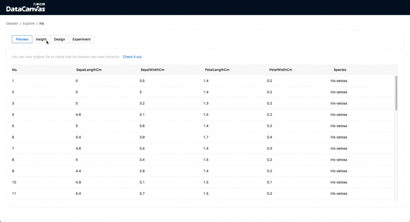

<p align="center">


[](https://pypi.org/project/hypergbm)
[](https://pepy.tech/project/hypergbm)
[](https://pypi.org/project/hypergbm)

[Doc](https://cooka.readthedocs.io) | [简体中文](README_zh_CN.md)

Cooka is a lightweight and visualization toolkit to manage datasets and design model learning experiments through web UI.
It using [DeepTables](https://github.com/DataCanvasIO/DeepTables) and [HyperGBM](https://github.com/DataCanvasIO/HyperGBM) as experiment engine to complete feature engineering, neural architecture search and hyperparameter tuning automatically.
    


## Features overview 
Through the web UI provided by cooka you can:

- Add and analyze datasets
- Design experiment
- View experiment process and result
- Using models
- Export experiment to jupyter notebook 

Screen shots：
<table style="border: none">
    <th></th>
    <th></th>
</table>

The machine learning algorithms supported are ：
- XGBoost
- LightGBM
- Catboost

The neural networks supported are：
- WideDeep
- DeepFM
- xDeepFM
- AutoInt
- DCN
- FGCNN 
- FiBiNet
- PNN
- AFM
- [...](https://deeptables.readthedocs.io/en/latest/models.html)


The search algorithms supported are：
- Evolution
- MCTS(Monte Carlo Tree Search)
- [...](https://github.com/DataCanvasIO/HyperGBM)

The supported feature engineering provided by  [scikit-learn](https://scikit-learn.org) and [featuretools](https://github.com/alteryx/featuretools) are：

- Scaler
    - StandardScaler
    - MinMaxScaler
    - RobustScaler
    - MaxAbsScaler
    - Normalizer
   
- Encoder
    - LabelEncoder
    - OneHotEncoder
    - OrdinalEncoder

- Discretizer
    - KBinsDiscretizer
    - Binarizer

- Dimension Reduction
    - PCA

- Feature derivation
    - featuretools

- Missing value filling
    - SimpleImputer 

It can also extend the search space to support more feature engineering methods and modeling algorithms.

## Installation 

### Using pip

The python version should be >= 3.6, for CentOS , install the system package:

```shell script
pip install --upgrade pip
pip install cooka
```

Start the web server：
```shell script
cooka server
```

Then open `http://<your_ip:8000>` with your browser to use cooka.

By default, the cooka configuration file is at `~/.config/cooka/cooka.py`,  to generate a template:
```shell script
mkdir -p ~/.config/cooka/
cooka generate-config > ~/.config/cooka/cooka.py
```

### Using Docker

Launch a Cooka docker container:

```shell script
docker run -ti -p 8888:8888 -p 8000:8000 -p 9001:9001 -e COOKA_NOTEBOOK_PORTAL=http://<your_ip>:8888 datacanvas/cooka:latest
```

Open `http://<your_ip:8000>` with your browser to visit cooka.

## Citation

If you use Cooka in your research, please cite us as follows:

Haifeng Wu, Jian Yang. Cooka: A Python Package for Lightweight and Visualization AutoML System. https://github.com/DataCanvasIO/Cooka, 2021. Version 0.1.x
```
@misc{cooka,
  author={Haifeng Wu, Jian Yang},
  title={{Cooka}: {A Python Package for Lightweight and Visualization AutoML System}},
  howpublished={https://github.com/DataCanvasIO/Cooka},
  note={Version 0.1.x},
  year={2021}
}
```

## DataCanvas


Cooka is an open source project created by [DataCanvas](https://www.datacanvas.com/). 


