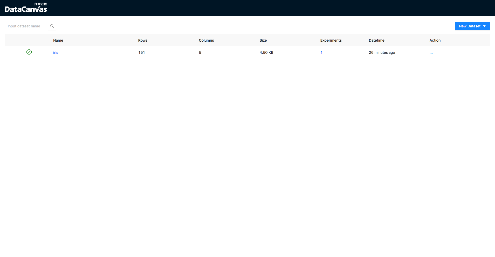
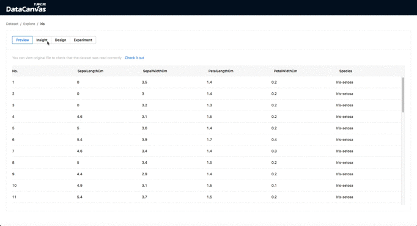

# Cooka
[](https://pypi.org/project/hypergbm)
[](https://pepy.tech/project/hypergbm)
[](https://pypi.org/project/hypergbm)

[文档](https://cooka.readthedocs.io/zh_CN/latest) | [English](README.md)

Cooka是一个轻量级、可视化的自动机器学习工具，可以通过Web UI管理数据集和设计建模实验，
并使用[DeepTables](https://github.com/DataCanvasIO/DeepTables) 和[HyperGBM](https://github.com/DataCanvasIO/HyperGBM)
执行，从而自动进行特征工程、算法超参数调优和神经网络架构搜索。


## 功能概览  
通过Cooka提供的Web UI可以：

- 添加、分析数据集
- 设计建模实验
- 查看实验过程和结果
- 使用模型
- 建模过程导出成Jupyter Notebook

Web页面截图：
<table style="border: none">
    <th></th>
    <th></th>
</table>

建模支持的算法有：
- XGBoost
- LightGBM
- Catboost

建模支持的神经网络有：
- WideDeep
- DeepFM
- xDeepFM
- AutoInt
- DCN
- FGCNN 
- FiBiNet
- PNN
- AFM
- [...](https://deeptables.readthedocs.io/en/latest/models.html)


搜索支持的算法有：
- 强化学习
- 蒙特卡洛树搜索
- [...](https://github.com/DataCanvasIO/HyperGBM)

支持由[scikit-learn](https://scikit-learn.org) 和[featuretools](https://github.com/alteryx/featuretools) 提供的特征工程：

- 缩放
    - StandardScaler
    - MinMaxScaler
    - RobustScaler
    - MaxAbsScaler
    - Normalizer
   
- 编码
    - LabelEncoder
    - OneHotEncoder
    - OrdinalEncoder

- 离散化
    - KBinsDiscretizer
    - Binarizer

- 降维
    - PCA

- 特征衍生
    - featuretools

- 缺失值填充
    - SimpleImputer 

还以可以通过扩展搜索空间支持更多的特征工程方法和建模算法。

## 安装 

### 通过pip安装

需要python版本不低于3.6，从[PYPI](https://pypi.org)中安装Cooka:
```shell script
pip install --upgrade pip
pip install cooka
```

启动Web服务：
```shell script
cooka server
```
然后使用浏览器访问`http://<your_ip:8000>`来使用Cooka。

Cooka配置文件默认在`~/.config/cooka/cooka.py`，生成配置文件模板：

```shell script
mkdir -p ~/.config/cooka/
cooka generate-config > ~/.config/cooka/cooka.py
```

### 使用Docker部署Cooka
```shell script
docker run -ti -p 8888:8888 -p 8000:8000 -p 9001:9001 -e COOKA_NOTEBOOK_PORTAL=http://<your_ip>:8888 datacanvas/cooka:latest
```
然后使用浏览器访问`http://<your_ip:8000>`来使用Cooka。


## DataCanvas


Cooka is an open source project created by [DataCanvas](https://www.datacanvas.com/). 
