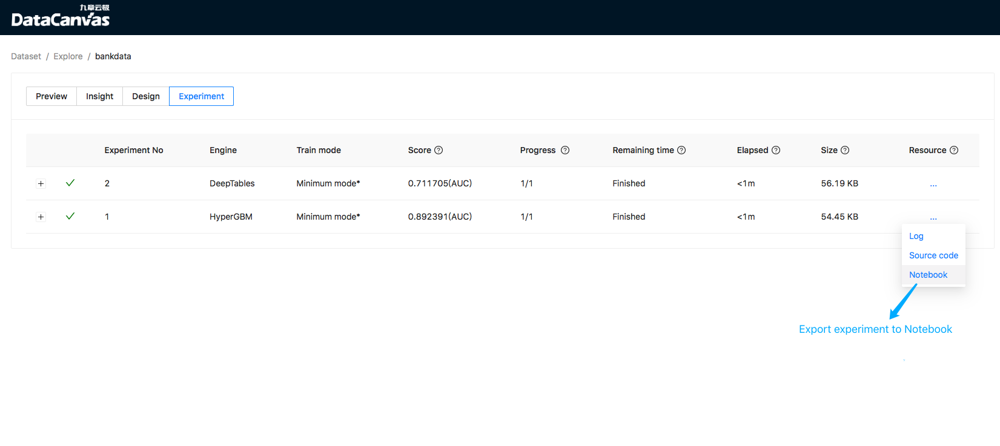

## Integrate with Jupyter Notebook

**1. Install dependencies**

In the experiment list, you can export the experiment to notebook：

An example of using deeptables as an experimental engine is [here](docs/pages/export_DeepTables_expriment_example.ipynb).

It needs python module:
- shap: model explain
- jupyterlab: notebook server
- matplotlib: plot in notebook

You may refer to this [guide]() to install shap;

Install jupyterlab using pip:
```shell script
pip install jupyterlab
```

matplotlib dependency on system package `graphviz` take install it on centos7 as an example:
```shell script
yum install graphviz
```

and then install matplotlib using pip:
```shell script
pip install matplotlib
```

**2. Start jupyter**

Start a jupyterab server in cooka working directory, default it at `~/cooka`: 
```shell script
cd ~/cooka
jupyter-lab --ip=0.0.0.0 --no-browser --allow-root --NotebookApp.token= 
```

**3. Configure cooka**

Then configuration notebook portal in cooka config file `~/.config/cooka/cooka.py`:
```shell script
c.CookaApp.notebook_portal = "http://<change_to_you_jupyter_ip>:8888"
```

Finally, start the web server and try to export a experiment to notebook:

```shell script
cooka server
```

