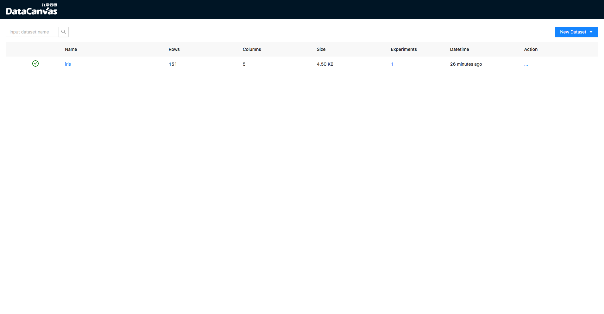

================
Welcome to Cooka
================

Cooka is a lightweight and visualization system to manage datasets and design model learning experiments through web UI.

It using `DeepTables <https://github.com/DataCanvasIO/DeepTables>`_ and `HyperGBM <https://github.com/DataCanvasIO/HyperGBM>`_ as experiment engine to complete feature engineering, neural architecture search and hyperparameter tuning automatically.

.. image:: ../../static/datacanvas_automl_toolkit.png

-----------------
Features overview
-----------------

Through the web UI provided by cooka you can:

1. Add and analyze datasets
2. Design experiment
3. View experiment process and result
4. Using models
5. Export experiment to jupyter notebook

**Screen shots**

.. image:: ../../static/cooka_train.gif
   :width: 500

The machine learning algorithms supported are ：

- XGBoost
- LightGBM
- Catboost

The neural networks supported are：

- WideDeep
- DeepFM
- xDeepFM
- AutoInt
- DCN
- FGCNN
- FiBiNet
- PNN
- AFM
- `... <https://deeptables.readthedocs.io/en/latest/models.html>`_

The search algorithms supported are：

- Evolution
- MCTS(Monte Carlo Tree Search)
- `... <https://github.com/DataCanvasIO/HyperGBM>`_

The supported feature engineering provided by  `scikit-learn <https://scikit-learn.org>`_ and `featuretools <https://github.com/alteryx/featuretools>`_ are：

- Scaler
    - StandardScaler
    - MinMaxScaler
    - RobustScaler
    - MaxAbsScaler
    - Normalizer

- Encoder
    - LabelEncoder
    - OneHotEncoder
    - OrdinalEncoder

- Discretizer
    - KBinsDiscretizer
    - Binarizer

- Dimension Reduction
    - PCA

- Feature derivation
    - featuretools

- Missing value filling
    - SimpleImputer

It can also extend the search space to support more feature engineering methods and modeling algorithms.

Read more:

.. toctree::
   :maxdepth: 2

   Installation<installation.md>
   User Guide<user_guide.md>
   Configuration<configuration.rst>
   Release Note<release_note.rst>

DataCanvas
----------

.. image:: ../../static/dc_logo_1.png

Cooka is an open source project created by `DataCanvas <https://www.datacanvas.com/>`_ .

