## User Guide

The purpose of this document is to help you to use Cooka in web browser, including:

- Manage dataset
- Preview dataset
- Insight dataset
- Design experiment
- Experiment list

We recommend Chrome v59 or above to visit Cooka.

### Manage dataset 

You can upload or import data from the server for training and the data file should meet the following conditions：

1. At least 2 columns
2. In CSV format
3. With headers or not

You can also choose the sampling strategy to analyze the dataset, supported sampling strategies:

- by rows
- by percentage
- whole data

Datasets can be added in the dataset list page:

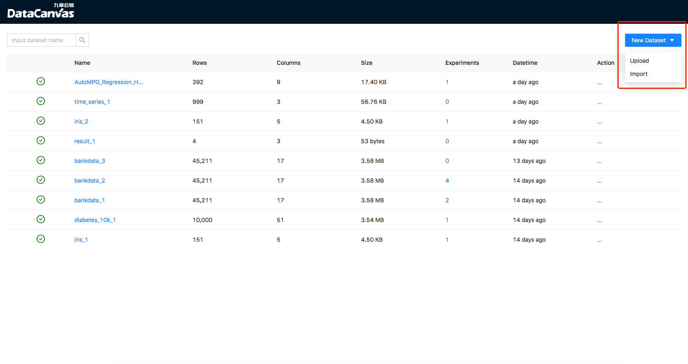

#### Upload

Users can upload files to Cooka through the browser to create datasets:

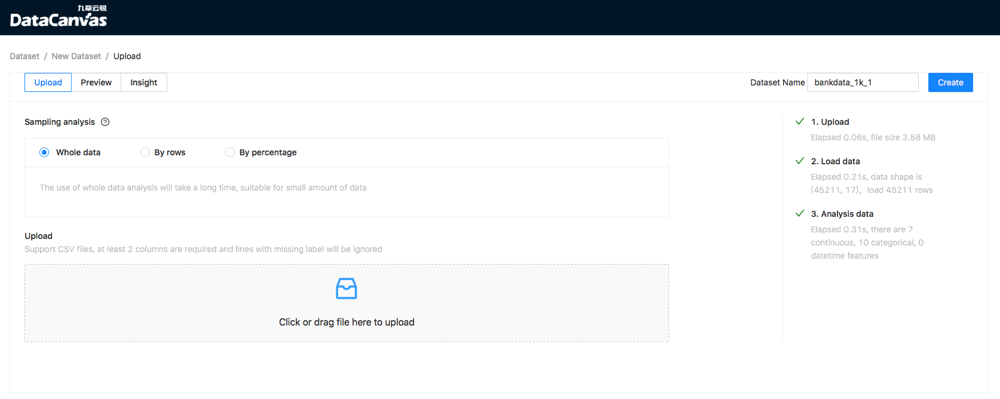

#### Import

Users can import files in server to Cooka. This way is friendly to large files, import process:

1. Input file path in server and wait it check passed
2. Click "Analyze" button, cooka will do analyze and the progress informantion should be displayed in the bar on the right
3. Check dataset name and click "Create" button to confirm 

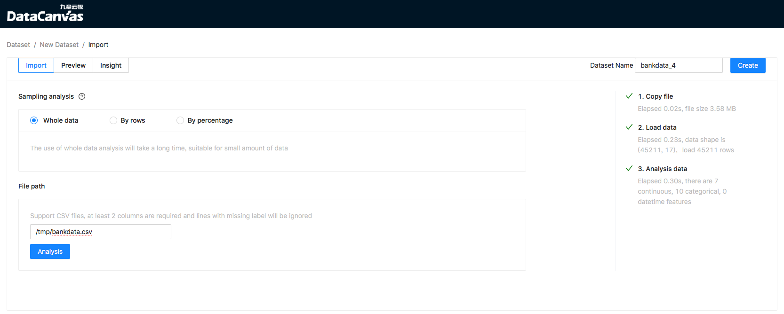

### Preview dataset 

You can view CSV file data in table view in "Preview" page:

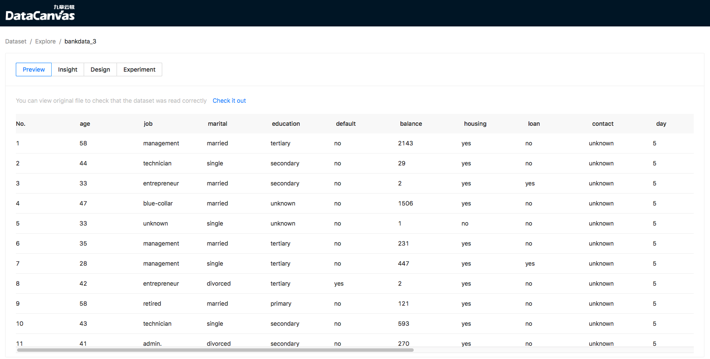

### Insight dataset 

Cooka will analyze the information of dataset, including:
- distribution of different feature types
- data type, feature type, unques, missing percentage, linear correlation of feature

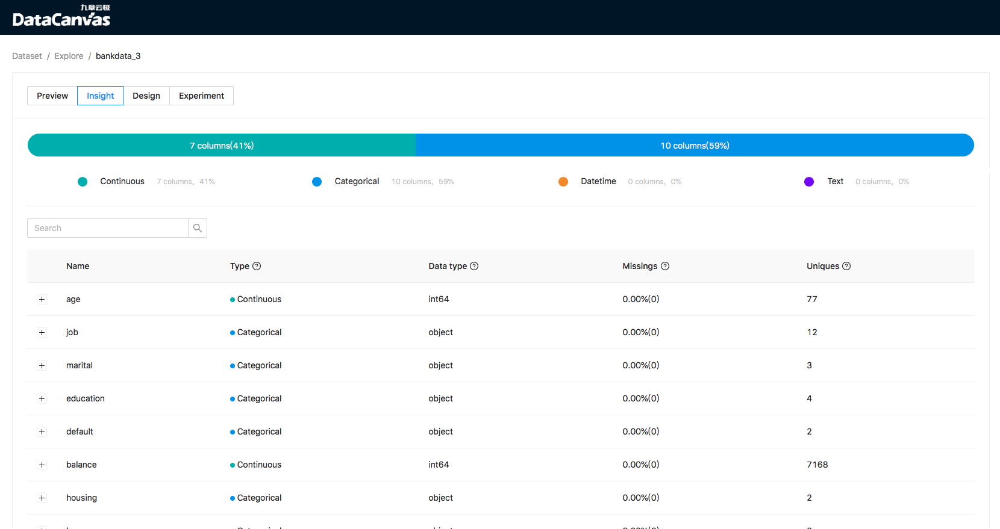

It will show mode and numerical distribution for categorical features:

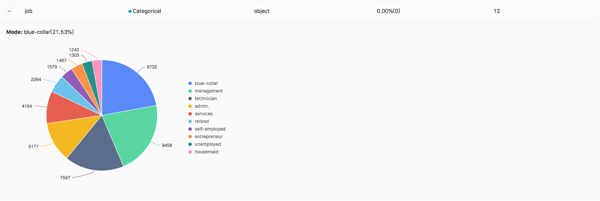

For continuous features, you can view the min/max/mean/median/standard deviation and the values distribution or interval distribution:

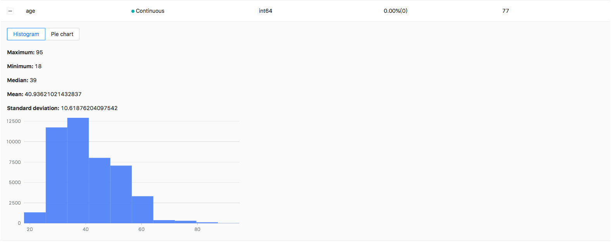

The values distribution：

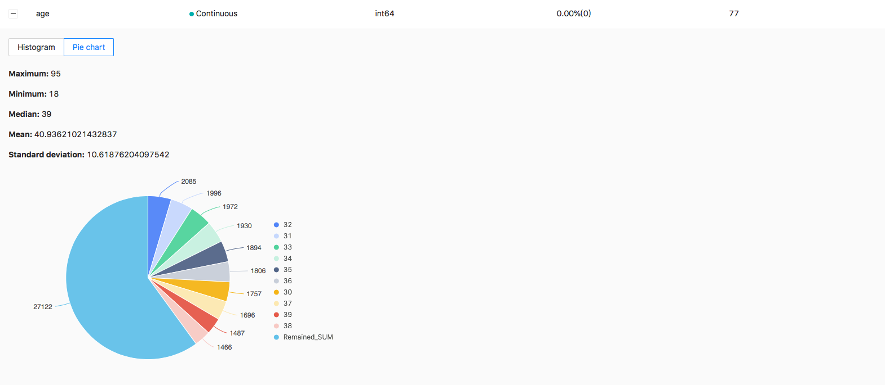

For datetime feature you can see statistics by year, month, day, hour, week:

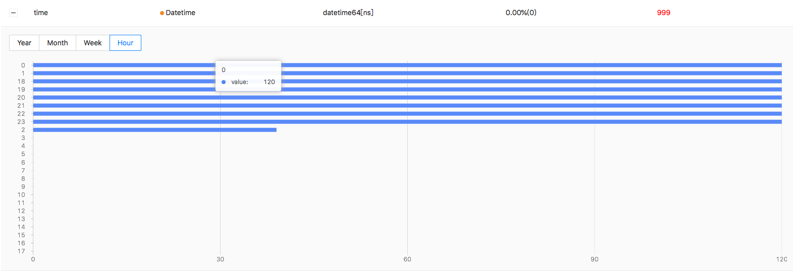  

 Cooka can note the poor quality feature and the reason, for example:

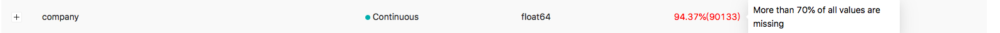

The reason may be：

1. Correlation is too low

2. Missing percentage is too high

3. Constant feature

4. Id-ness feature(Every value is unique)

### Design experiment 

Users can design modeling experiments to define real-life problems as a modeling task. On the data exploration page, users can select one as target column:

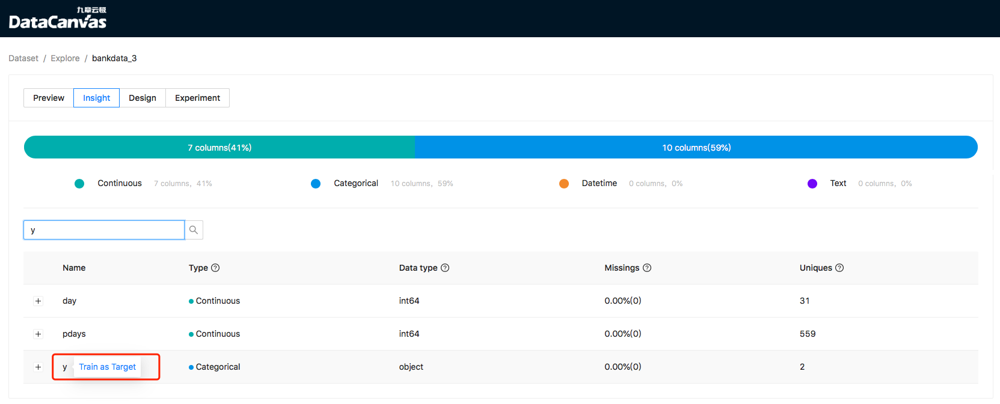

In the experiment design page, you can choose quick training mode or performance training mode. Quick mode uses general search space and less search times, while performance mode uses more comprehensive search space and more search times.
Fast mode makes a balance between training time and model effect, while performance mode sacrifices time to improve model effect:

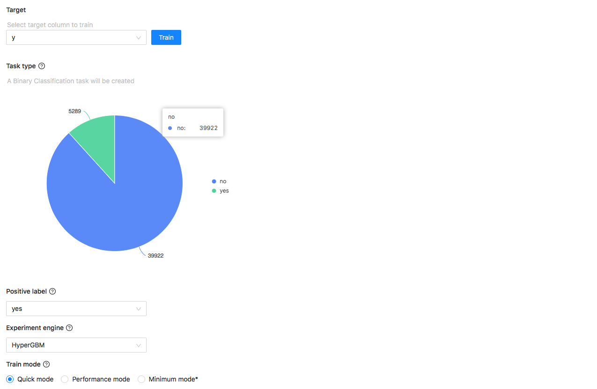

It will infer task type by the target column. There is 2 experiments engine HyperDT and HyperGBM, and they use neural network and GBM algorithms. If your data is in datatime order, you can select datetime series column, cooka will use the older data to train and the newer data to test model effect:

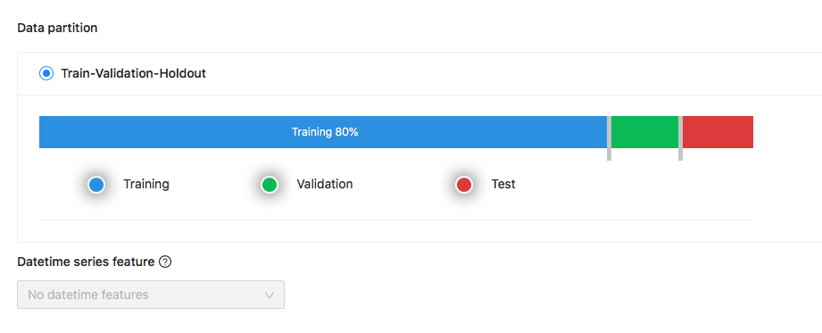 

### Experiment list

You can see the running status of the training task on the experiment list page, such as training progress and model score:

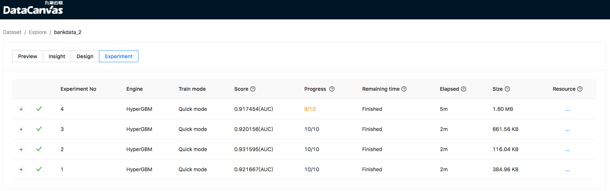

Cooka supports early stopping, when the performance of the model can not be improved, it will terminate the training process in advance to save computing resources.

#### Model evaluation

For the completed experiments, you can see the evaluation of model including:

1. Confusion matrix and ROC curve for binary-classification
2. Evaluaion metrics

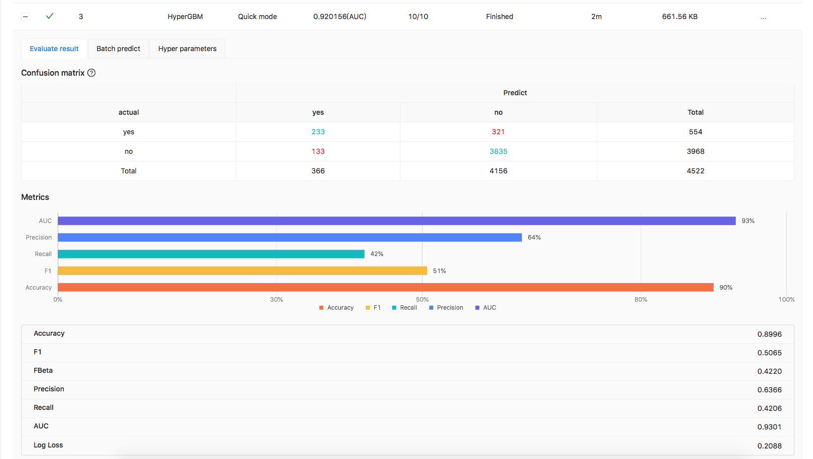

The ROC curve:

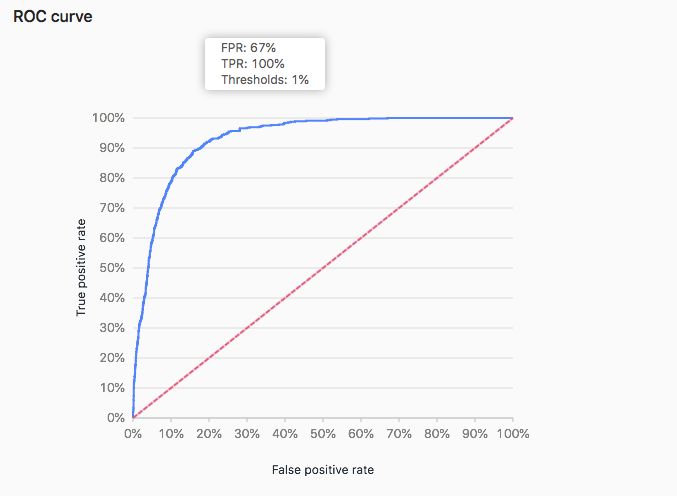

 

In the process of searching, Y-axes values represent the hyper parameters used in training, and the color of lines represents the score of the model, the darker the color, the higher the score:

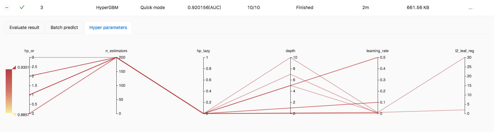

 

  

#### Model predict

The model will be saved in the training end, Users can upload test data to use the model, and the prediction progress will be displayed on the page:

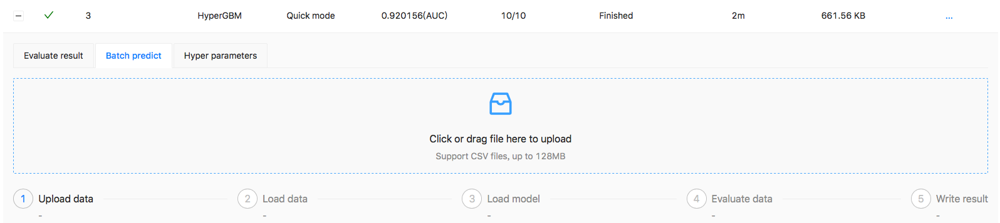 

The results can be downloaded when prediction finished.

#### Export to notebook

You can export experiment to notebook to custom modeling:

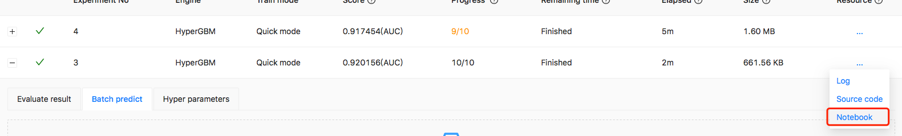

An example of Notebook：

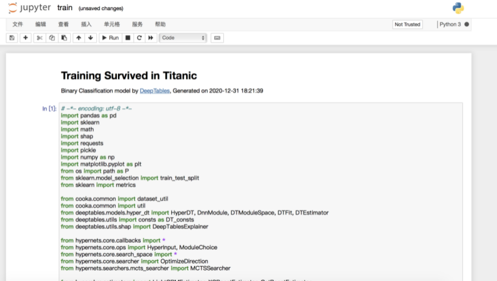 

Notebook also contains explanation of prediction:

 

   And feature importance：

 

If it is a binary classification task, the ROC curve and confusion matrix of the model will also be included.

 

 
