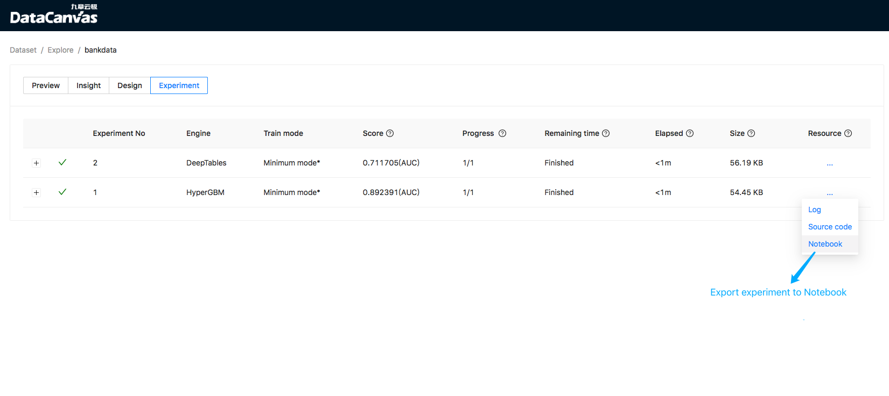

## Integrate with Jupyter Notebook

### Feature instruction
In the experiment list, you can export the experiment to notebook：

An example of using deeptables as an experimental engine is [here](docs/pages/export_DeepTables_expriment_example.ipynb).

### Operation
For ubuntu 18.04 install system dependencies：
```shell script
sudo apt-get update
# graphviz is for `matplotlib` and the others is for `shap`
sudo apt-get install -y graphviz gcc g++ make clang-10 python3-clang-10
```

Install cooka with notebook integration:
```shell script
# `tensorflow` needs latest verion of pip and `shap` needs to upgrade setuptools 
pip install --upgrade pip setuptool 
pip install cooka[notebook]
```

If occurs error link：
```shell script
ERROR: No .egg-info directory found in /tmp/pip-pip-egg-info-ssn_8tfq
```

Consider adding a file `~/.pydistutils.cfg` and reinstall the cooka. The file is as follows:
```shell script
[easy_install]
index_url = https://mirrors.aliyun.com/pypi/simple  # May replace to a other pypi mirror that you wonder
```

After installing Cooka, you can start jupyterab. The working directory of jupyterab should as same as Cooka, default is `~/cooka`: 
```shell script
cd ~/cooka
jupyter-lab --ip=0.0.0.0 --no-browser --allow-root --NotebookApp.token= 
```

Then configuration notebook portal :
```shell script
mkdir -p ~/.config/cooka
echo "c.CookaApp.notebook_portal = \"http://localhost:8888\"" >> ~/.config/cooka/cooka.py
```

Finally, start the web server:
```shell script
cooka server
```
