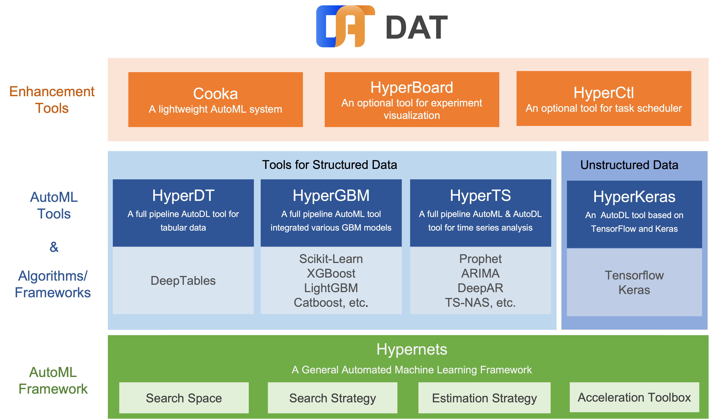

================
欢迎使用Cooka
================

Cooka是一个轻量级、可视化的自动机器学习工具，可以通过Web UI管理数据集和设计建模实验，并使用 `DeepTables <https://github.com/DataCanvasIO/DeepTables>`_ 和 `HyperGBM <https://github.com/DataCanvasIO/HyperGBM>`_ 执行，从而自动进行特征工程、算法超参数调优和神经网络架构搜索。

--------
功能概览
--------

通过Cooka提供的Web UI可以：

- 添加、分析数据集
- 设计建模实验
- 查看实验过程和结果
- 使用模型
- 建模过程导出成Jupyter Notebook

Web页面截图：

.. image:: ../../static/cooka_home_page.png
   :width: 500

.. image:: ../../static/cooka_train.gif
   :width: 500

建模支持的算法有：

- XGBoost
- LightGBM
- Catboost

建模支持的神经网络有：

- WideDeep
- DeepFM
- xDeepFM
- AutoInt
- DCN
- FGCNN
- FiBiNet
- PNN
- AFM
- `More nets <https://deeptables.readthedocs.io/en/latest/models.html>`_

搜索支持的算法有：

- 强化学习
- 蒙特卡洛树搜索
- `More searchers <https://github.com/DataCanvasIO/HyperGBM>`_

支持由 `scikit-learn <https://scikit-learn.org>`_ 和 `featuretools <https://github.com/alteryx/featuretools>`_ 提供的特征工程：

- 缩放
    - StandardScaler
    - MinMaxScaler
    - RobustScaler
    - MaxAbsScaler
    - Normalizer

- 编码
    - LabelEncoder
    - OneHotEncoder
    - OrdinalEncoder

- 离散化
    - KBinsDiscretizer
    - Binarizer

- 降维
    - PCA

- 特征衍生
    - featuretools

- 缺失值填充
    - SimpleImputer

还以可以通过扩展搜索空间支持更多的特征工程方法和建模算法。

更多文档:

.. toctree::
   :maxdepth: 2

   安装文档<installation.md>
   操作手册<user_guide.md>
   配置文档<configuration.rst>
   Release Note<release_note.rst>

DataCanvas
----------

.. image:: ../../static/dc_logo_1.png

Cooka is an open source project created by `DataCanvas <https://www.datacanvas.com/>`_ .
