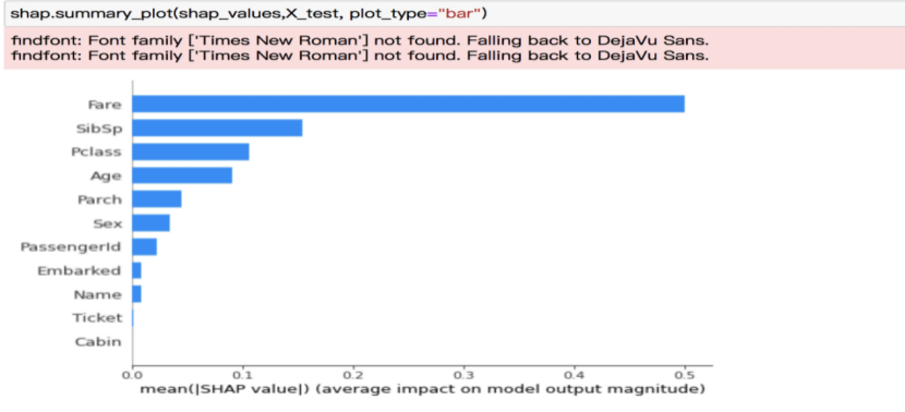

## 用户操作手册

Cooka客户端需要Chrome浏览器v59以上版本。

### 数据集管理

Cooka允许用户上传或者导入服务器上的数据来进行建模训练，支持使用无列头的数据，在数据集列表页可以新增数据集：

 

 

#### 导入

用户可以填写服务器上的数据文件地址，当系统确认文件正常符合建模要求后，单击分析，可以对数据集进行进一步的分析，在右侧信息栏可以显示分析的进度，以及简要信息，确认无误后点击创建。这种方式适用于文件比较大的情况，避免通过浏览器上传由于网络原因导致网络中断。

 

### 上传

用户可以通过浏览器将本地的文件上传到系统创建数据集：

 

对数据分析时候还可以选择抽样策略，Cooka可以按比例、或者行数抽样来加快分析进度。

 

### 数据预览

通过数据预览可以直观地看到数据内容，当系统解析的文件格式与预期的文件格式不相符时候，还可以查看原始数据集。

 

 

### 数据探查

创建数据集的过程中Cooka会自动分析特征的信息，包括不同类型特征的分布、每个特征的数据、数值分布、缺失值率等信息：

 

当模型训练后Cooka还可以自动分析出特征列与目标列的线性相关性，来分析哪些特征更有用。对于类别型特征Cooka可以分析出众数和数值分布：

 

对于连续型特征可以分析其分布、极值等信息：

 

还有其离散性的分析：

 

 

对于日期类型数据，还可以分析出其在不同年、月、日、时的分布：

 

  

  Cooka还会对质量较差以及原因进行标注：

 

可能被标注的情况：

1. 相关性太低

2. 缺失值太多

3. 重复值太多

4. 每一行的值都不同

 

### 实验设计

用户可以设计建模实验来把现实生活中存在的问题定义成一个建模任务，在数据探查页面可以选择目标列设计建模实验：

 

在实验设计页面可以选择快速训练模式和性能训练模式。快速模式使用较为常用的搜索空间，并使用较少的搜索次数，性能模式使用较为全面的搜索空间和较多的搜索次数。快速模式在训练时间和模型效果之间做了均衡，性能模式则是牺牲时间来提高模型的效果，建模设计页面：

 

 

根据标签列系统将自动推断任务类型、如果二分类还将自动推荐正样本。Cooka提供了HyperGBM，和HyperDT 两种实验引擎，HyperGBM使用梯度提升树算法，HyperDT使用神经网络算法，用户可以自行选择；还可以设置数据拆分比例。如果数据是按日期有序的，设置日期列后，Cooka会使用较旧的数据用来训练模型，较新的数据用来测试模型效果。

 

### 实验列表

  在实验设计页面确认训练之后， 在实验列表页面可以监控训练任务运行的情况，Cooka会监控任务运行状态，比如训练进度、模型得分:

 

Cooka支持提前停止算法，当模型的性能无法提升会提前终止训练过程来节省计算资源。

### 模型评估

对于已经完成的实验还可以查看其运行结果，软件会对模型的效果进行评估，比如准确率，或者误差分析，通过比较直观的方式来评价模型的优劣:

 

 

对于二分类模型还会绘制Roc曲线：

 

模型训练的过程中，会动态显示每次搜索的参数以及其得分表现，其中多个y轴来表示训练所使用的超参数，线条的颜色来表示模型的分数，颜色越深代表的得分越高，可以比较直观地显示优质参数：

 

 

 

 

### 模型预测

训练成功的模型会被保存下来，用户可以提交新的数据来使用模型，在模型预测页面，可以通过浏览器上传数据，Cooka预测过程中会在页面上展示预测进度：

 

结果可以在预测结束后下载到本地。

### 导出Notebook

模型还可以导出Jupyer Notebook，用户可以以API编程的方式进一步优化模型：

 

导出后的Notebook：

 

Notebook中会包含对预测结果的解释：

 

   以及特征重要性：

 

 如果是二分类任务，模型的roc曲线和混淆矩阵也会展示。
